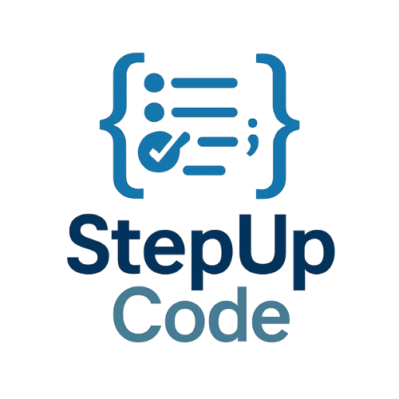

# StepUp Code
<p align="center">
	
</p>


Repositorio GitHub para la aplicación [StepUP Code](https://www.youtube.com/watch?v=p-fRdRLUs44&feature=youtu.be), desarrollada dentro de un Proyecto de Innovación Educativa (PIE) para la realización de pruebas de tipo test en la asignatura Estructuras de Datos.

La aplicación tiene las siguientes herramientas:
- [Sistema de gestión de usuarios](https://github.com/misantamaria/StepUp/wiki/Gesti%C3%B3n-de-usuarios).
- Tests de prueba iniciales
- Panel de administración Django
- Base de datos inicial con MySQL


## Requisitos
- Python 3.11+
- MySQL
- pip/venv
  
## Estructura del repositorio

```
StepUp/
├── app/                          #  StepUp - Estructuras de Datos (PRINCIPAL)
│   ├── stepup_config/            # Configuración Django
│   ├── boards/                   # App de tableros (interfaces con información y controles, dashboards)
│   ├── users/                    # App de usuarios
│   ├── tests/preguntas/          # XMLs de preguntas
│   ├── manage.py
│   ├── requirements.txt
│   ├── .env.example
│   └── ...
├── docker/                          #  Docker para el lanzamiento en servidor
|   |── .env.example                # Configuración de ejemplo básica
|   |── Dockerfile
|   |── docker-compose.yml
|   |── entrypoint.sh 
├── media/                          #  Ficheros media para la aplicación web
|── dump_PIE_ED.sql
|── schema.sql
└── README.md                     # Este archivo
```